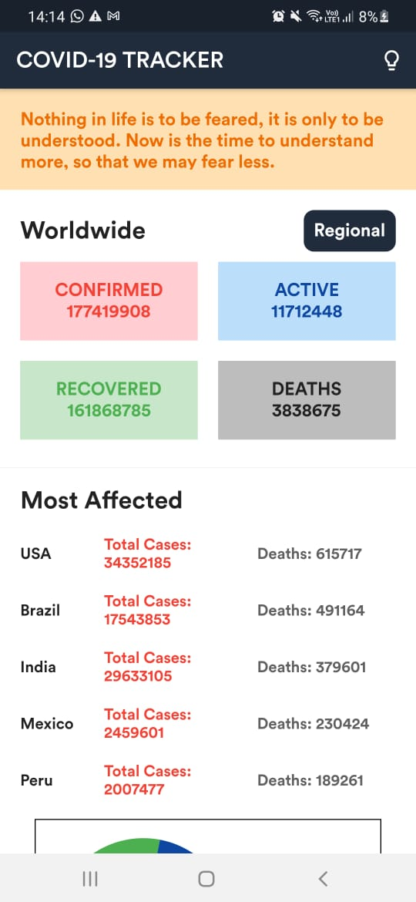

# Hello :wave:

Welcome to **Covid_Tracker** project. 

## My motivation

I created this app to understand the working of API's in Flutter.

## Technology/ Stack used

- **Mobile framework**: Flutter v1.17.4

## Screenshots & Gif

Here are some screenshots of my work -

  
  
  

  
  

### If you like my work please give me a :star:, it will motivate me to do more awesome work :blush: